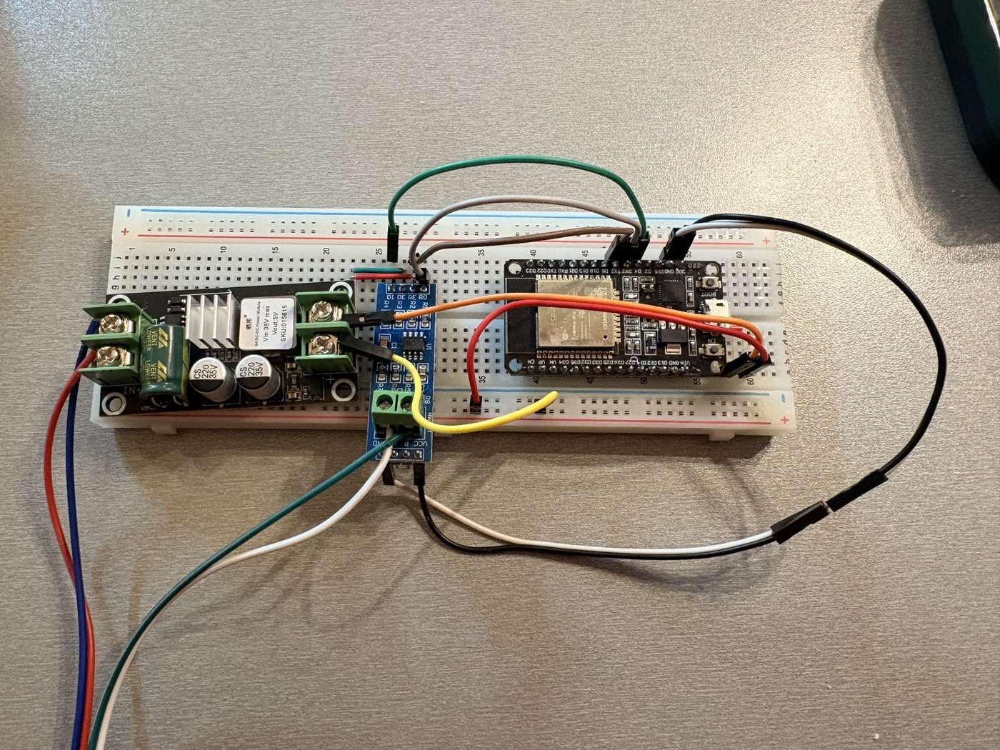
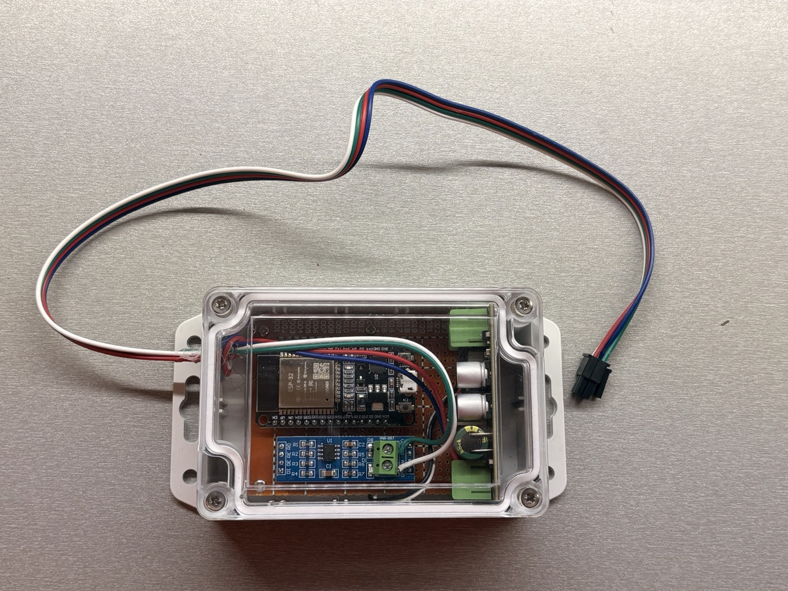
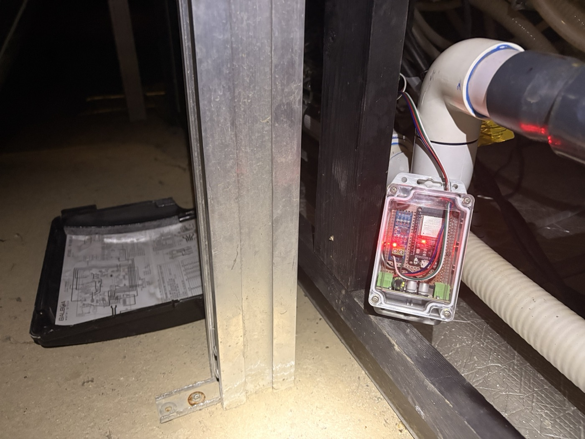
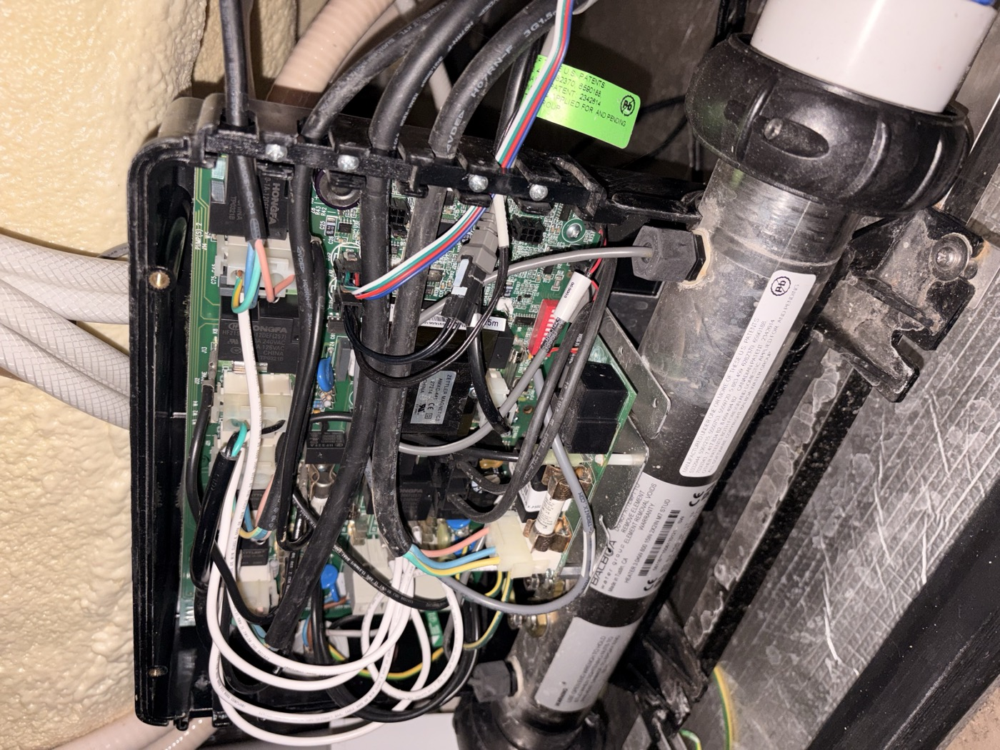
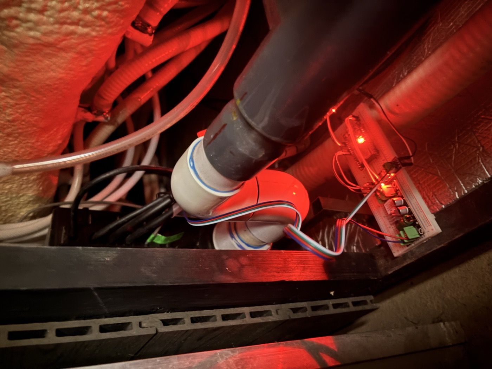
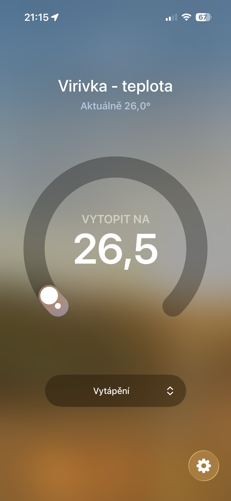
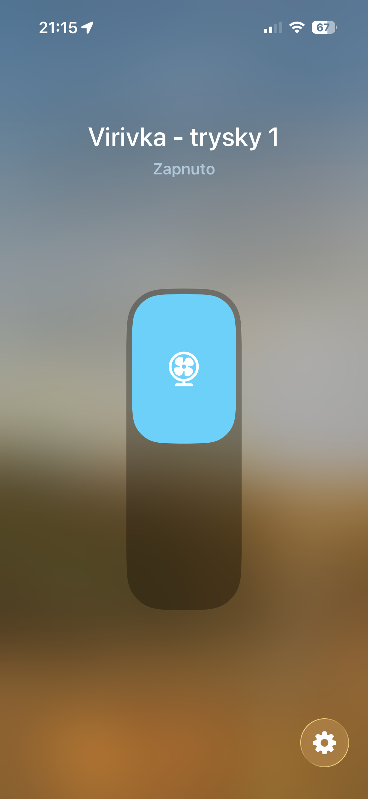
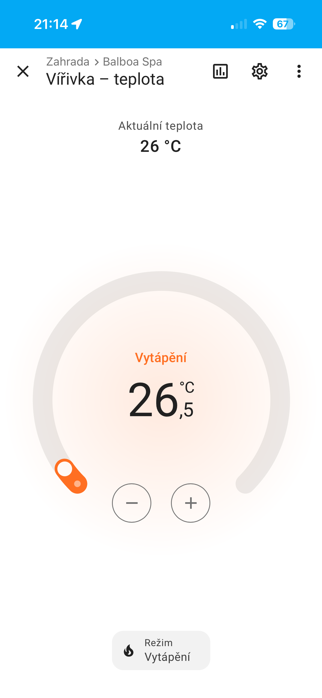
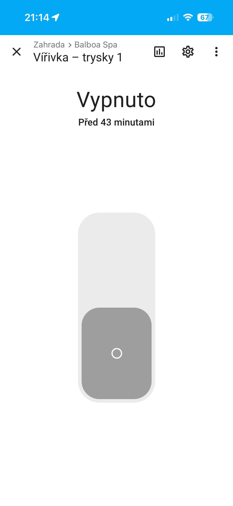

# Balboa ESP32 — RS485 WiFi controller

ESP32 modul pro vzdálené ovládání vířivky Balboa přes RS485 sběrnici a MQTT.
ESP32 module for remote control of a Balboa hot tub via RS485 bus and MQTT.

---

## Fotografie / Photos

### Hardware

| Prototyp (breadboard) | Finální stavba v krabičce |
|---|---|
|  |  |

| Instalace u vířivky | Balboa řídicí deska |
|---|---|
|  |  |


*Detail instalace — krabička s ESP32 připojená na RS485 sběrnici vířivky*

### HomeKit & Home Assistant

| HomeKit — teplota | HomeKit — trysky 1 |
|---|---|
|  |  |

| Home Assistant — teplota | Home Assistant — trysky 1 |
|---|---|
|  |  |

---

## 🇨🇿 Česky

### Popis

Projekt umožňuje ovládání vířivky **Balboa BP2100G1** (PN 56389-02) přes WiFi a MQTT broker.
ESP32 se připojuje na sběrnici RS485 a emuluje WiFi modul Balboa (BWA app) s adresou `0x0A`.

Funguje s **Node-RED**, **Home Assistantem** nebo jakýmkoliv MQTT klientem.

### Hardware

| Součástka | Popis |
|---|---|
| **ESP32** (30-pin DevKit) | Hlavní MCU, WiFi, RS485 komunikace |
| **MAX485** (nebo SP3485) | RS485 transceiver, half-duplex |
| Vířivka **Balboa BP2100G1** | Testováno s firmware PN 56389-02 |

### Zapojení

```
ESP32                MAX485
─────────────────────────────
GPIO 4  (TX2)  ──►  DI
GPIO 16 (RX2)  ◄──  RO
GPIO 17 (DE/RE) ──► DE + RE  (spojeny dohromady)
GND            ───  GND
3.3V / 5V      ───  VCC

MAX485         Vířivka (konektor J35)
──────────────────────────────────────
A              A (RS485+)
B              B (RS485-)
```

> ⚠️ **Důležité**: DE a RE jsou spojeny dohromady na jediný GPIO. Receiver je během vysílání vypnutý — echo ověření TX nefunguje, což je normální chování.

Vířivka má dedikovaný WiFi slot **J35** (a fyzický panel na J34) — oba sdílejí stejnou RS485 sběrnici.

### Instalace

1. Zkopíruj `include/config.h.example` jako `include/config.h`
2. Vyplň WiFi SSID/heslo a adresu MQTT brokeru
3. Nahraj firmware přes PlatformIO: `pio run --target upload`

### MQTT — čtení stavu

**Topic:** `balboa/state` (retained JSON, aktualizuje se při každé změně nebo každých 10s)

```json
{
  "water_temp": 26.5,
  "set_temp":   38.0,
  "time":       "14:30",
  "jets1":      0,
  "jets2":      0,
  "blower":     0,
  "heater":     2,
  "circulation": 1,
  "high_range": 1,
  "light":      0,
  "heating_mode": "ready",
  "clock_24h":  1,
  "hold":       0,
  "hold_mins":  0
}
```

| Pole | Hodnoty | Popis |
|---|---|---|
| `water_temp` | °C (float) | Aktuální teplota vody |
| `set_temp` | °C (float) | Nastavená cílová teplota |
| `time` | `"HH:MM"` | Čas na displeji vířivky |
| `jets1` / `jets2` | 0/1 | Trysky 1 / 2 |
| `blower` | 0/1 | Bubliny / vzduchové trysky |
| `heater` | 0/1/2 | Ohřev: 0=vypnuto, 1=čeká (bliká), 2=topí |
| `circulation` | 0/1 | Cirkulační čerpadlo |
| `high_range` | 0/1 | Vysoký teplotní rozsah (do 40°C) |
| `light` | 0/1 | Světlo |
| `heating_mode` | `"ready"` / `"economy"` | Režim ohřevu |
| `clock_24h` | 0/1 | 24hodinový formát času |
| `hold` | 0/1 | Přidrž / pauza ohřevu |
| `hold_mins` | 0–60 | Zbývající minuty přidržení |

**Topic:** `balboa/filter_config` (retained JSON, aktualizuje se při změně nebo každých 30s)

```json
{
  "fc1_start": "00:00",
  "fc1_dur":   "5h00m",
  "fc2_start": "12:00",
  "fc2_dur":   "5h00m",
  "fc2_enabled": 1
}
```

### MQTT — příkazy

| Topic | Payload | Popis |
|---|---|---|
| `balboa/cmd/jets1` | `TOGGLE` | Přepnout trysky 1 |
| `balboa/cmd/jets2` | `TOGGLE` | Přepnout trysky 2 |
| `balboa/cmd/blower` | `TOGGLE` | Přepnout bubliny |
| `balboa/cmd/light` | `TOGGLE` | Přepnout světlo |
| `balboa/cmd/high_range` | `TOGGLE` | Přepnout vysoký teplotní rozsah |
| `balboa/cmd/heating_mode` | `TOGGLE` | Přepnout ready ↔ economy |
| `balboa/cmd/hold` | `TOGGLE` | Přidrž (pauza ohřevu 60 min) |
| `balboa/cmd/set_temp` | `"38.0"` | Nastavit cílovou teplotu (°C, krok 0.5) |
| `balboa/cmd/set_time` | `"14:30"` | Nastavit čas (24h výchozí), přidej `12` pro 12h formát |
| `balboa/cmd/set_filter` | `"H1:M1 DH1:DM1 H2:M2 DH2:DM2"` | Nastavit filtrační cykly |
| `balboa/cmd/dump` | cokoliv | Výpis 200 raw framů do serial logu |
| `balboa/cmd/passive` | cokoliv | Pasivní poslech (bez odesílání, 500 framů) |

**Příklad set_filter** — FC1 od 00:00 po 5h, FC2 od 12:00 po 5h:
```
balboa/cmd/set_filter  →  "0:00 5:00 12:00 5:00"
```

### Balboa RS485 protokol (zkrácené)

- Rychlost: 115200 baud
- Frame: `7E [ML] [addr] [BF/AF] [type] [payload...] [CRC] 7E`
- Status broadcast: `FF AF 13` každé ~1–2s
- CTS (Clear To Send): `[dest] BF 06`
- NTS (Nothing To Send): `[src] BF 07`
- Toggle příkaz: `0A BF 11 [kód] 00`
- Nastavit teplotu: `0A BF 20 [tempRaw]` kde `tempRaw = temp_C × 2`
- Nastavit čas: `0A BF 21 [hour|0x80_pro_24h] [minute]`
- Filtrační cykly: `0A BF 23 [h1 m1 dh1 dm1 h2|0x80 m2 dh2 dm2]`

### Kódy přepínačů (BF 11)

| Kód | Funkce |
|---|---|
| `0x04` | Trysky 1 |
| `0x05` | Trysky 2 |
| `0x0C` | Bubliny |
| `0x11` | Světlo |
| `0x3C` | Přidrž (60 min) |
| `0x50` | Vysoký teplotní rozsah |
| `0x51` | Režim ohřevu (ready/economy) |

---

## 🇬🇧 English

### Description

This project enables remote control of a **Balboa BP2100G1** hot tub (PN 56389-02) via WiFi and an MQTT broker.
The ESP32 connects to the RS485 bus and emulates a Balboa WiFi module (BWA app) using address `0x0A`.

Compatible with **Node-RED**, **Home Assistant**, or any MQTT client.

### Hardware

| Component | Description |
|---|---|
| **ESP32** (30-pin DevKit) | Main MCU, WiFi, RS485 communication |
| **MAX485** (or SP3485) | RS485 transceiver, half-duplex |
| **Balboa BP2100G1** hot tub | Tested with firmware PN 56389-02 |

### Wiring

```
ESP32                MAX485
─────────────────────────────
GPIO 4  (TX2)  ──►  DI
GPIO 16 (RX2)  ◄──  RO
GPIO 17 (DE/RE) ──► DE + RE  (tied together)
GND            ───  GND
3.3V / 5V      ───  VCC

MAX485         Hot tub (connector J35)
──────────────────────────────────────
A              A (RS485+)
B              B (RS485-)
```

> ⚠️ **Important**: DE and RE are tied together to a single GPIO. The receiver is disabled during transmission — TX echo verification will always return empty, which is normal behaviour.

The hot tub has a dedicated WiFi slot **J35** (physical panel on J34) — both share the same RS485 bus.

### Installation

1. Copy `include/config.h.example` to `include/config.h`
2. Fill in your WiFi SSID/password and MQTT broker address
3. Upload firmware via PlatformIO: `pio run --target upload`

### MQTT — reading state

**Topic:** `balboa/state` (retained JSON, updated on change or every 10s)

```json
{
  "water_temp": 26.5,
  "set_temp":   38.0,
  "time":       "14:30",
  "jets1":      0,
  "jets2":      0,
  "blower":     0,
  "heater":     2,
  "circulation": 1,
  "high_range": 1,
  "light":      0,
  "heating_mode": "ready",
  "clock_24h":  1,
  "hold":       0,
  "hold_mins":  0
}
```

| Field | Values | Description |
|---|---|---|
| `water_temp` | °C (float) | Current water temperature |
| `set_temp` | °C (float) | Target temperature |
| `time` | `"HH:MM"` | Time shown on spa display |
| `jets1` / `jets2` | 0/1 | Jets 1 / 2 |
| `blower` | 0/1 | Air blower |
| `heater` | 0/1/2 | Heater: 0=off, 1=standby (flashing), 2=heating |
| `circulation` | 0/1 | Circulation pump |
| `high_range` | 0/1 | High temperature range (up to 40°C) |
| `light` | 0/1 | Light |
| `heating_mode` | `"ready"` / `"economy"` | Heating mode |
| `clock_24h` | 0/1 | 24-hour clock format |
| `hold` | 0/1 | Hold mode (heater pause) |
| `hold_mins` | 0–60 | Minutes remaining in hold |

**Topic:** `balboa/filter_config` (retained JSON, updated on change or every 30s)

```json
{
  "fc1_start": "00:00",
  "fc1_dur":   "5h00m",
  "fc2_start": "12:00",
  "fc2_dur":   "5h00m",
  "fc2_enabled": 1
}
```

### MQTT — commands

| Topic | Payload | Description |
|---|---|---|
| `balboa/cmd/jets1` | `TOGGLE` | Toggle jets 1 |
| `balboa/cmd/jets2` | `TOGGLE` | Toggle jets 2 |
| `balboa/cmd/blower` | `TOGGLE` | Toggle blower |
| `balboa/cmd/light` | `TOGGLE` | Toggle light |
| `balboa/cmd/high_range` | `TOGGLE` | Toggle high temperature range |
| `balboa/cmd/heating_mode` | `TOGGLE` | Toggle ready ↔ economy |
| `balboa/cmd/hold` | `TOGGLE` | Hold mode (pause heating for 60 min) |
| `balboa/cmd/set_temp` | `"38.0"` | Set target temperature (°C, step 0.5) |
| `balboa/cmd/set_time` | `"14:30"` | Set time (24h default), append ` 12` for 12h mode |
| `balboa/cmd/set_filter` | `"H1:M1 DH1:DM1 H2:M2 DH2:DM2"` | Set filter cycles |
| `balboa/cmd/dump` | anything | Dump 200 raw frames to serial log |
| `balboa/cmd/passive` | anything | Passive listen mode (no TX, 500 frames) |

**set_filter example** — FC1 from 00:00 for 5h, FC2 from 12:00 for 5h:
```
balboa/cmd/set_filter  →  "0:00 5:00 12:00 5:00"
```

### Balboa RS485 protocol (summary)

- Baud rate: 115200
- Frame: `7E [ML] [addr] [BF/AF] [type] [payload...] [CRC] 7E`
- Status broadcast: `FF AF 13` every ~1–2s
- CTS (Clear To Send): `[dest] BF 06`
- NTS (Nothing To Send): `[src] BF 07`
- Toggle command: `0A BF 11 [code] 00`
- Set temperature: `0A BF 20 [tempRaw]` where `tempRaw = temp_C × 2`
- Set time: `0A BF 21 [hour|0x80_for_24h] [minute]`
- Filter cycles: `0A BF 23 [h1 m1 dh1 dm1 h2|0x80 m2 dh2 dm2]`

### Toggle codes (BF 11)

| Code | Function |
|---|---|
| `0x04` | Jets 1 |
| `0x05` | Jets 2 |
| `0x0C` | Blower |
| `0x11` | Light |
| `0x3C` | Hold (60 min) |
| `0x50` | High temperature range |
| `0x51` | Heating mode (ready/economy) |

### Protocol reference

- [Balboa Worldwide App protocol documentation](https://github.com/ccutrer/balboa_worldwide_app/blob/main/doc/protocol.md)

---

## License

MIT
